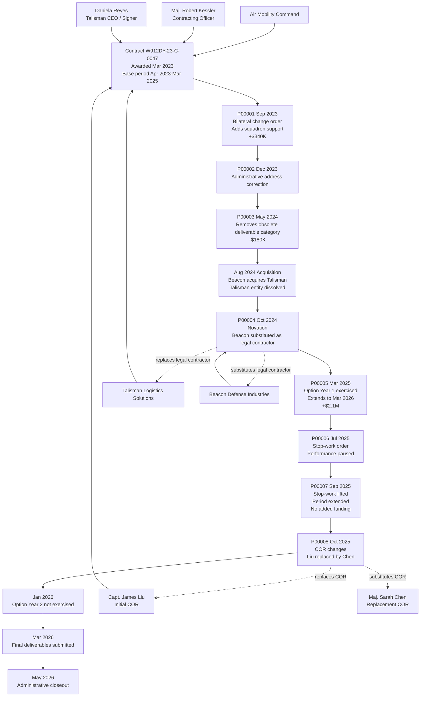

# Contract Lifecycle Mermaid Diagram

```mermaid
flowchart TD
    A["Contract W912DY-23-C-0047<br/>Awarded Mar 2023<br/>Base period Apr 2023-Mar 2025"] --> B["P00001 Sep 2023<br/>Bilateral change order<br/>Adds squadron support<br/>+$340K"]
    B --> C["P00002 Dec 2023<br/>Administrative address correction"]
    C --> D["P00003 May 2024<br/>Removes obsolete deliverable category<br/>-$180K"]
    D --> E["Aug 2024 Acquisition<br/>Beacon acquires Talisman<br/>Talisman entity dissolved"]
    E --> F["P00004 Oct 2024<br/>Novation<br/>Beacon substituted as legal contractor"]
    F --> G["P00005 Mar 2025<br/>Option Year 1 exercised<br/>Extends to Mar 2026<br/>+$2.1M"]
    G --> H["P00006 Jul 2025<br/>Stop-work order<br/>Performance paused"]
    H --> I["P00007 Sep 2025<br/>Stop-work lifted<br/>Period extended<br/>No added funding"]
    I --> J["P00008 Oct 2025<br/>COR changes<br/>Liu replaced by Chen"]
    J --> K["Jan 2026<br/>Option Year 2 not exercised"]
    K --> L["Mar 2026<br/>Final deliverables submitted"]
    L --> M["May 2026<br/>Administrative closeout"]

    GOV["Air Mobility Command"] --> A
    TAL["Talisman Logistics Solutions"] --> A
    CO["Maj. Robert Kessler<br/>Contracting Officer"] --> A
    CEO["Daniela Reyes<br/>Talisman CEO / Signer"] --> A
    COR1["Capt. James Liu<br/>Initial COR"] --> A

    BEA["Beacon Defense Industries"] --> F
    F -. "replaces legal contractor" .-> TAL
    F -. "substitutes legal contractor" .-> BEA

    J -. "replaces COR" .-> COR1
    J -. "substitutes COR" .-> COR2["Maj. Sarah Chen<br/>Replacement COR"]
```
